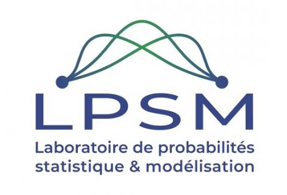

## Paper name.

Repository for [MGS-GRF paper](https://arxiv.org/pdf/2503.22730).

In praticular, you will find code to reproduce the paper experiments as well as an nice implementation of our *new* and *efficient* strategy for your projects.
## ⭐ Table of Contents
  - [Getting Started](#getting-started)
  - [Data sets](#data-sets)
  - [Acknowledgements](#acknowledgements)

## ⭐ Getting Started

If you want to reproduce our paper experiments:
  - Section 4.2 : the [pyhton file](protocols/run_synthetic_coherence.py) reproduce the experiments (data sets, oversampling and traing). Then the results can be analyzed [here](protocols/notebooks/res_coh.ipynb).
  - Section 4.3 : the   [pyhton file](protocols/run_synthetic_association.py) reproduce the experiments (data sets, oversampling and traing). Then the results can be analyzed [here](protocols/notebooks/res_asso.ipynb).
  - Section 5 : the [pyhton file](protocols/run_protocol-final.py) reproduce the experiments (data sets, oversampling and traing). Then the results can be analyzed [here](protocols/notebooks/res_real_data.ipynb).

## ⭐ Data sets

The data sets of used for our article should be dowloaded  inside the *data/externals* folder. The data sets are available at the followings adresses :

* [BankMarketing](https://archive.ics.uci.edu/dataset/222/bank+marketing)
* [BankChurners](https://www.kaggle.com/datasets/thedevastator/predicting-credit-card-customer-attrition-with-m)


## ⭐ Acknowledgements

This work was done through a partenership between **Artefact Research Center** and the **Laboratoire de Probabilités Statistiques et Modélisation** (LPSM) of Sorbonne University.

[](https://www.artefact.com/data-consulting-transformation/artefact-research-center/)  |  [](https://www.lpsm.paris/)
:-------------------------:|:-------------------------:

If you find the code usefull, please consider citing us :
```
@article{sakho2025harnessing,
  title={Harnessing Mixed Features for Imbalance Data Oversampling: Application to Bank Customers Scoring},
  author={Sakho, Abdoulaye and Malherbe, Emmanuel and Gauthier, Carl-Erik and Scornet, Erwan},
  journal={arXiv preprint arXiv:2503.22730},
  year={2025}
}
```