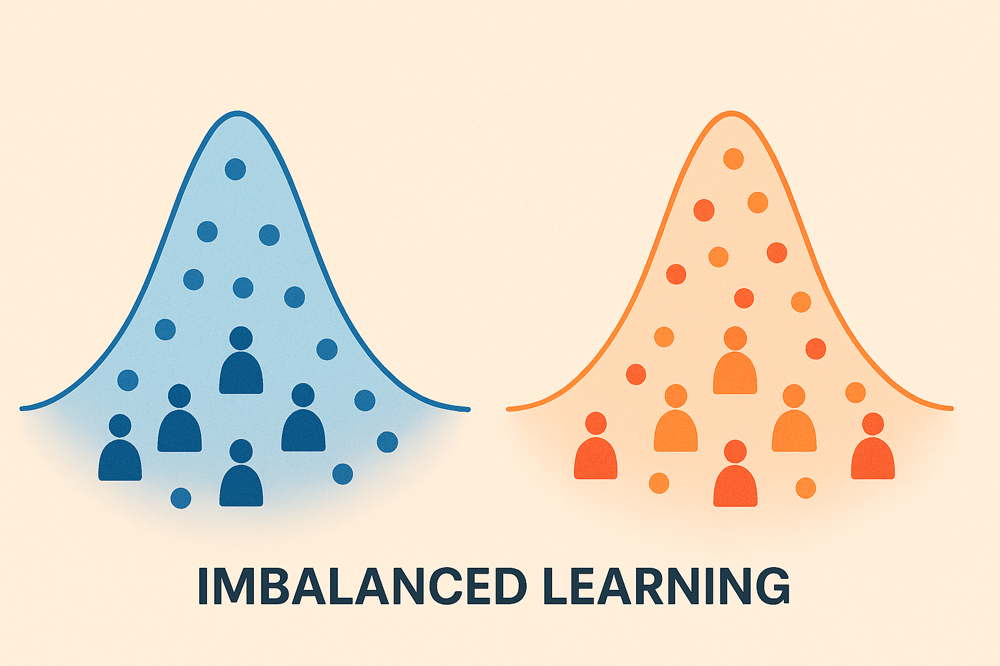

<div align="center">

# Harnessing Mixed Features for Imbalance Data Oversampling: Application to Bank Customers Scoring


Abdoulaye SAKHO<sup>1, 2</sup>, Emmanuel MALHERBE<sup>1</sup>, Carl-Erik GAUTHIER<sup>3</sup>, Erwan SCORNET<sup>2</sup> <br>
 <sup>1</sup> <sub> Artefact Research Center, </sub> <br> <sup>2</sup> <sub>*LPSM* - Sorbonne Université,</sub> <sup>3</sup> <sub>Société Générale</sub>

Preprint. <br>
[[Full Paper]](https://arxiv.org/pdf/2503.22730) <br>

</div>

<p align="center"></p>

**Abstract:** *This study investigates rare event detection on tabular data within binary classification. Many real-world classification tasks, such as in banking sector, deal with mixed features, which have a significant impact on predictive performances. To this purpose, we introduce MGS-GRF, an oversampling strategy designed for mixed features. This method uses a kernel density estimator with locally estimated full-rank covariances to generate continuous features, while categorical ones are drawn from the original samples through a generalized random forest.*

You will find code to reproduce the paper experiments as well as an nice implementation of our *new* and *efficient* strategy for your projects.
## ⭐ Table of Contents
  - [How to use MGS-GRF](#-how-to-use-the-mgs-grf-algorithm-to-learn-on-imbalanced-data)
  - [Reproducing the paper experiments](#-reproducing-the-paper-experiments)
  - [Data sets](#-data-sets)
  - [Acknowledgements](#-acknowledgements)
  - [Citation](#-citation)

## ⭐ How to use the MGS-GRF Algorithm to learn on imbalanced data
Here is a short example on how to use MGS-GRF: 
```python
from mgs_grf import MGSGRFOverSampler
from mgs_grf import DrfSk

## Apply MGS-GRF procedure to oversample the data
mgs_grf = MGSGRFOverSampler(K=len(numeric_features),categorical_features=categorical_features, Classifier=DrfSk(),random_state=0)
balanced_X, balanced_y = mgs_grf.fit_resample(X_train,y_train)
print("Augmented data : ", Counter(balanced_y))

## Encode the categorical variables
enc = OneHotEncoder(handle_unknown='ignore',sparse_output=False)
balanced_X_encoded = enc.fit_transform(balanced_X[:,categorical_features])
balanced_X_final = np.hstack((balanced_X[:,numeric_features],balanced_X_encoded))

# Fit the final classifier on the augmented data
clf_mgs = lgb.LGBMClassifier(n_estimators=100,verbosity=-1, random_state=0)
clf_mgs.fit(balanced_X_final, balanced_y)

```
A more detailed notebook example is available [here](example/example.ipynb).


## ⭐ Reproducing the paper experiments

If you want to reproduce our paper experiments:
  - Section 4.2 : the [Python file](protocols/run_synthetic_coherence.py) reproduce the experiments (data sets, oversampling and traing). Then the results can be analyzed with this [notebook](protocols/notebooks/res_coh.ipynb).
  - Section 4.3 : the   [Python file](protocols/run_synthetic_association.py) reproduce the experiments (data sets, oversampling and traing). Then the results can be analyzed with this [notebook](protocols/notebooks/res_asso.ipynb).
  - Section 5 : the [Python file](protocols/run_protocol-final.py) reproduce the experiments (data sets, oversampling and traing). Then the results can be analyzed with this [notebook](protocols/notebooks/res_real_data.ipynb).

## ⭐ Data sets

The data sets of used for our article should be dowloaded  inside the *data/externals* folder. The data sets are available at the followings adresses :

* [BankMarketing](https://archive.ics.uci.edu/dataset/222/bank+marketing)
* [BankChurners](https://www.kaggle.com/datasets/thedevastator/predicting-credit-card-customer-attrition-with-m)


## ⭐ Acknowledgements

This work was done through a partenership between **Artefact Research Center** and the **Laboratoire de Probabilités Statistiques et Modélisation** (LPSM) of Sorbonne University.

<p align="center">
  <a href="https://www.artefact.com/data-consulting-transformation/artefact-research-center/">
    
  </a>
  &emsp;
  &emsp;
  <a href="https://www.lpsm.paris/">
    
  </a>
</p>


## ⭐ Citation

If you find the code usefull, please consider citing us :
```
@article{sakho2025harnessing,
  title={Harnessing Mixed Features for Imbalance Data Oversampling: Application to Bank Customers Scoring},
  author={Sakho, Abdoulaye and Malherbe, Emmanuel and Gauthier, Carl-Erik and Scornet, Erwan},
  journal={arXiv preprint arXiv:2503.22730},
  year={2025}
}
```
