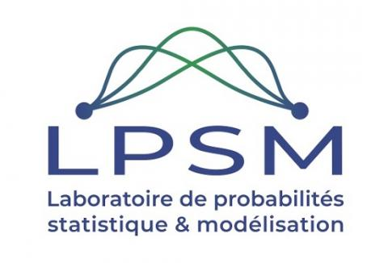

<div align="center">

# MGS-GRF

[](https://github.com/artefactory/mgs-grf/actions/workflows/ci.yaml?query=branch%3Amain)
[](https://github.com/astral-sh/ruff)
[](https://github.com/artefactory/mgs-grf/blob/main/.pre-commit-config.yaml)
[](LICENSE)

[](https://pypi.org/project/mgs-grf/)
[](https://pypi.org/project/mgs-grf/)
[](./CITATION.bib)


</div>

If you face *imbalance data* in your machine learning project, this package is here to pre-process your data. It is an efficient and ready-to-use implementation of
MGS-GRF, an oversampling strategy designed to handle large-scale and mixed imbalanced data-set — with *both continuous and categorical features*.

The MGS-GRF package is supported by two peer-reviewed publications:
> &nbsp; &nbsp; A paper at AISTATS 2026 introducing the algorithm for continuous input: *Do we need rebalancing strategies? A theoretical and empirical study around SMOTE and its variants* [📄](https://arxiv.org/abs/2402.03819)

> &nbsp; &nbsp; A paper at ECML-PKDD 2025 presenting the extension of MG to categorical features (MGS-GRF), *Harnessing Mixed Features for Imbalance Data Oversampling: Application to Bank Customers Scoring*  [📄](https://ecmlpkdd-storage.s3.eu-central-1.amazonaws.com/preprints/2025/ads/preprint_ecml_pkdd_2025_ads_1005.pdf)


## 🛠 Installation

**From Pypi**:
```bash
pip install mgs-grf
```

**From source**:
```bash
git clone git@github.com:artefactory/mgs-grf.git
```

And install the required packages into your environment (conda, mamba or pip):
```bash
pip install -r requirements.txt
```

## 🚀 How to use the MGS-GRF Algorithm to learn on imbalanced data
Here is a short example on how to use MGS-GRF: 
```python
from mgs_grf import MGSGRFOverSampler

## Apply MGS-GRF procedure to oversample the data
mgs_grf = MGSGRFOverSampler(categorical_features=categorical_features, random_state=0)
X_train_balanced, y_train_balanced = mgs_grf.fit_resample(X_train_imbalanced, y_train_imbalanced)

## Encode the categorical variables
enc = OneHotEncoder(handle_unknown="ignore", sparse_output=False)
X_train_balanced_enc = np.hstack((X_train_balanced[:,numeric_features],
                                  enc.fit_transform(X_train_balanced[:,categorical_features])))
X_test_enc = np.hstack((X_test[:,numeric_features], enc.transform(X_test[:,categorical_features])))

# Fit the final classifier on the augmented data
clf = lgb.LGBMClassifier(n_estimators=100, verbosity=-1, random_state=0)
clf.fit(X_train_balanced_enc, y_train_balanced)

```
A more detailed notebook example is available in [this notebook](example/example.ipynb).


## 🙏 Acknowledgements

This work was done through a partenership between **Artefact Research Center** and the **Laboratoire de Probabilités Statistiques et Modélisation** (LPSM) of Sorbonne University.

<p align="center">
  <a href="https://www.artefact.com/data-consulting-transformation/artefact-research-center/">
    
  </a>
  &emsp;
  &emsp;
  <a href="https://www.lpsm.paris/">
    
  </a>
</p>


## 📜 Citation

If you find the code useful, please consider citing us :

```
@article{sakho2024we,
  title={Do we need rebalancing strategies? A theoretical and empirical study around SMOTE and its variants},
  author={Sakho, Abdoulaye and Malherbe, Emmanuel and Scornet, Erwan},
  journal={arXiv preprint arXiv:2402.03819},
  year={2024}
}
```
```
@inproceedings{sakho2025harnessing,
  title={Harnessing Mixed Features for Imbalance Data Oversampling: Application to Bank Customers Scoring},
  author={Sakho, Abdoulaye and Malherbe, Emmanuel and Gauthier, Carl-Erik and Scornet, Erwan},
  booktitle={Joint European Conference on Machine Learning and Knowledge Discovery in Databases},
  pages={247--264},
  year={2025},
  organization={Springer}
}
```
